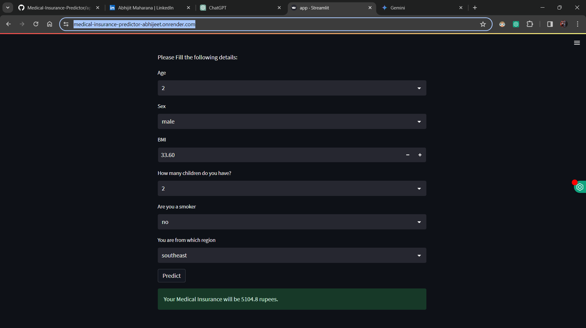
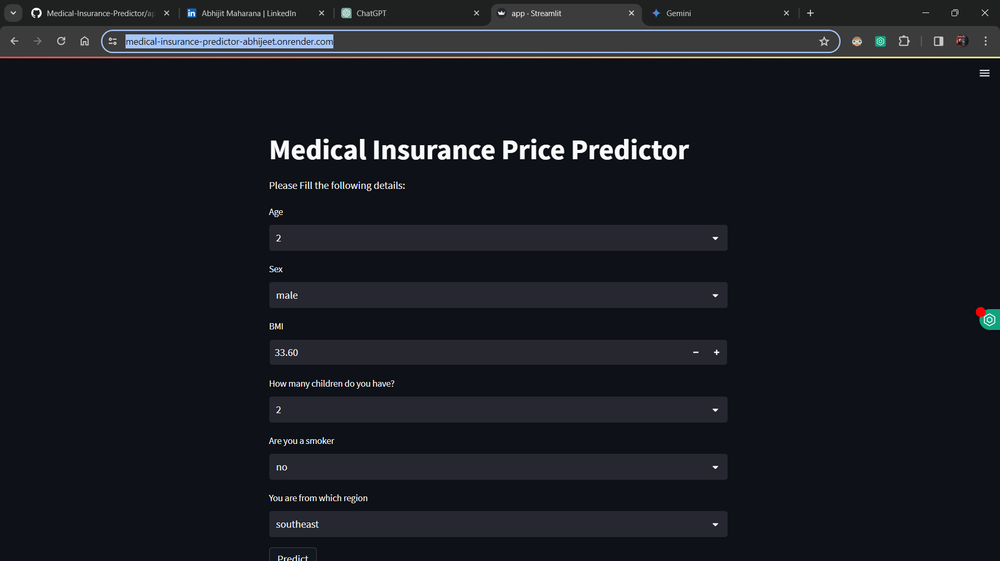

# Medical Insurance Price Predictor

This project implements a machine learning regression model to predict medical insurance charges based on user-provided details such as smoking status, number of children, gender, age, BMI, and region. The user-friendly interface allows individuals to estimate their average insurance price before purchasing medical insurance.

## Table of Contents

- [Introduction](#introduction)
- [Technologies/Tools Used](#technologies-tools-used)
- [Description](#description)
- [Installation](#installation)
- [Usage](#usage)
- [Screenshots](#screenshots)
- [Contributing](#contributing)
- [License](#license)

## Introduction

Medical Insurance Price Predictor is a tool designed to help individuals estimate their medical insurance charges based on various factors. By utilizing machine learning regression techniques, the model predicts insurance costs, providing users with valuable insights before making insurance decisions.

## Technologies/Tools Used

- Python
- Streamlit
- Pandas
- Scikit-learn

## Description

This project implements a regression model trained on a dataset containing medical insurance information. Users can input their details such as age, sex, BMI, number of children, smoking status, and region through the user interface. The model then predicts the medical insurance charges based on these inputs, helping users make informed decisions about their insurance needs.

## Installation

1. Clone the repository:

    ```bash
    git clone https://github.com/your_username/medical-insurance-predictor.git
    ```

2. Navigate to the project directory:

    ```bash
    cd medical-insurance-predictor
    ```

3. Install dependencies:

    ```bash
    pip install -r requirements.txt
    ```

## Usage

1. Run the Streamlit web application:

    ```bash
    streamlit run app.py
    ```

2. Fill in the required details such as age, sex, BMI, number of children, smoking status, and region.
3. Click the "Predict" button to estimate the medical insurance charges.

## Screenshots




## Contributing

Contributions are welcome! Please fork the repository and create a pull request with your proposed changes.

## License

This project is licensed under the [MIT License](LICENSE).
